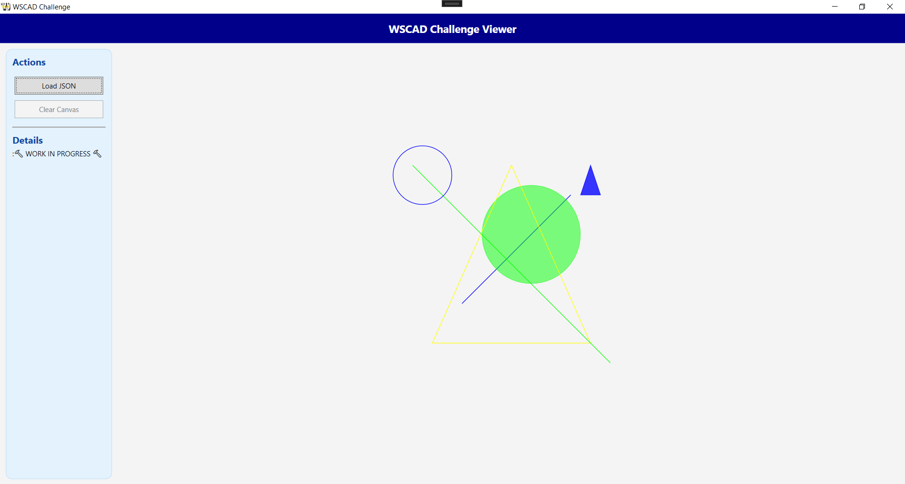

# WSCAD Challenge: Shape Drawing Application

## Overview

The **WSCAD Challenge** is a robust shape drawing application built using **WPF (Windows Presentation Foundation)**, designed to render geometric shapes, including **Lines**, **Circles**, and **Triangles**. The application allows for the dynamic manipulation of these shapes with various transformations, such as scaling, and provides detailed information like bounding boxes for each shape.

This project demonstrates the implementation of the **MVVM pattern** for clean separation of concerns, leveraging C# for the logic and WPF for the UI rendering.

## Features

- **Shape Rendering**: Draws basic geometric shapes (Lines, Circles, Triangles) with specified properties such as color and fill.
- **Zooming Functionality**: Supports zooming in and out to scale the shapes dynamically.
- **Bounding Box Calculation**: Automatically calculates the bounding box for each shape, providing an outline of the space it occupies.
- **Extensibility**: The architecture allows easy extension by adding new shapes or modifying the drawing strategies.
- **MVVM Architecture**: Implements the Model-View-ViewModel (MVVM) design pattern for clear separation of business logic and UI.

## Technologies Used

- **C#**: Core programming language for the logic and shape handling.
- **WPF (Windows Presentation Foundation)**: Used for rendering and displaying UI components.
- **MVVM Pattern**: Separation of concerns between UI (View), business logic (ViewModel), and data (Model).
- **LINQ**: For efficient data manipulation and querying.
- **XAML**: UI layout and design specification.

## Project Structure

The project is organized into the following key components:

- **Models**: Contains the shape entities such as `Line`, `Circle`, `Triangle`, each representing a different geometric shape.
- **Utilities**: Includes helper classes, transformations (e.g., scaling), and common utility functions.
- **DrawingStrategies**: Implements the logic for rendering each shape on the canvas, ensuring separation of concerns between shape types.
- **ViewModels**: Provides the data and logic necessary to interact with the UI, adhering to the MVVM design pattern.
- **Views**: Contains the XAML files defining the UI layout and binding to ViewModels.

## Getting Started

To begin working with the project, follow these steps:

### 1. Clone the Repository

```bash
git clone https://github.com/anisToumi1990/WSCAD_Challenge.git
cd wscad-challenge
```

### 2. Open the Project

Open the project solution (`.sln`) file in **Visual Studio**. Ensure that all necessary NuGet packages are restored.

### 3. Build the Solution

Use the following shortcut to build the solution:

- Press `Ctrl + Shift + B` to build the project.

### 4. Run the Application

Start the application by pressing `F5` or clicking "Start Debugging" from the toolbar. You should see a canvas where the shapes should be displayed.

## Example Screenshot




### Adding New Shapes

To add a new shape:

1. Create a new shape class in the **Models** directory (e.g., `Hexagon`).
2. Implement the drawing strategy for the new shape in the **DrawingStrategies** directory.
3. Update the **ViewModels** to bind and display the new shape in the UI.

### Adding New Drawing Strategies

To add a new drawing strategy:

1. Implement the `IDrawingStrategy` interface.
2. Define how to render the shape on the canvas and calculate its bounding box.
3. Integrate the new strategy into the **ViewModel** and ensure proper UI rendering.

## License

This project is licensed under the **MIT License**. See the [LICENSE](LICENSE) file for more details.

---

## Support

For support or inquiries regarding the project, please feel free to open an issue on GitHub.

---

## Acknowledgments

- Special thanks to the **WSCAD** team for this challenge and for providing the opportunity to demonstrate geometric shape rendering using WPF.
- Thanks to the **open-source community** for the tools and libraries that make this project possible.
